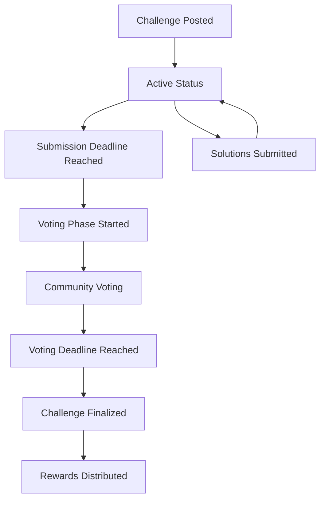

# 🧠 Neuro-Solve: Decentralized Neurological Research Platform

A blockchain-based platform for collaborative neurological research and problem-solving built on the Stacks blockchain using Clarity smart contracts.

## 🌟 Overview

Neuro-Solve revolutionizes neurological research by creating a decentralized marketplace where:
- **Researchers** can post neurological challenges and offer rewards
- **Scientists** can submit innovative solutions and methodologies
- **Peers** can review and vote on solution quality
- **Communities** can collaborate on breakthrough neurological discoveries
- **Rewards** are automatically distributed based on community consensus

## 🏗️ Platform Architecture

### Core Components

1. **Challenge System**: Post and manage neurological research challenges
2. **Solution Marketplace**: Submit detailed research solutions with methodologies
3. **Peer Review Network**: Community-driven quality assessment
4. **Reputation System**: Track researcher credentials and achievements
5. **Reward Distribution**: Automated STX-based compensation
6. **Voting Mechanism**: Democratic solution evaluation

### Smart Contract Features

#### 🔬 Research Challenges
- **Challenge Posting**: Create detailed neurological research problems
- **Reward Pool**: STX-based incentives for solution providers
- **Deadline Management**: Automated submission and voting periods
- **Status Tracking**: Active → Voting → Completed workflow

#### 🧪 Solution Submissions
- **Comprehensive Documentation**: Title, description, methodology, results
- **Data Integrity**: Cryptographic hashing for research data
- **Version Control**: Immutable solution records
- **Attribution**: Clear researcher ownership and credentials

#### 👥 Community Governance
- **Weighted Voting**: 1-5 scale solution evaluation
- **Peer Reviews**: Detailed feedback with scoring (1-10)
- **Reputation Building**: Merit-based researcher ranking
- **Anti-Gaming**: One vote per solution per user

#### 💰 Economic Model
- **Platform Fee**: 10% of challenge rewards (adjustable by admin)
- **Minimum Rewards**: Ensures meaningful incentives
- **Automated Distribution**: Smart contract-based payouts
- **Transparent Economics**: All fees and rewards on-chain

## 🚀 Getting Started

### Prerequisites

- [Clarinet 3.x](https://github.com/hirosystems/clarinet)
- [Stacks CLI](https://docs.stacks.co/docs/command-line-interface)
- Node.js (for testing and development)

### Installation

1. **Clone the repository**
   ```bash
   git clone <your-repo-url>
   cd Neuro-Solve
   ```

2. **Verify contract**
   ```bash
   clarinet check
   ```

3. **Start development environment**
   ```bash
   clarinet integrate
   ```

### Quick Start

#### For Researchers (Challenge Creators)

1. **Create Your Profile**
   ```clarity
   (contract-call? .Neuro-Solve create-profile 
     "Dr. Jane Smith" 
     "Harvard Medical School" 
     "Neurodegenerative Diseases")
   ```

2. **Post a Research Challenge**
   ```clarity
   (contract-call? .Neuro-Solve post-challenge
     "Novel Alzheimer's Treatment Approach"
     "Seeking innovative therapeutic strategies for early-stage Alzheimer's disease targeting amyloid plaques and tau proteins"
     "Neurodegenerative"
     u50000  ;; 50,000 microSTX reward
     u2880)  ;; ~20 days submission period
   ```

3. **Manage Challenge Lifecycle**
   ```clarity
   ;; Start voting after submission deadline
   (contract-call? .Neuro-Solve start-voting u1)
   
   ;; Finalize and distribute rewards
   (contract-call? .Neuro-Solve finalize-challenge u1 u1)
   ```

#### For Scientists (Solution Providers)

1. **Submit Your Solution**
   ```clarity
   (contract-call? .Neuro-Solve submit-solution
     u1  ;; challenge-id
     "Dual-Target Therapy Approach"
     "Comprehensive therapeutic strategy combining amyloid reduction with neuroprotective agents..."
     "Phase I clinical trial methodology with biomarker assessment..."
     "Preliminary results show 40% reduction in cognitive decline..."
     0x1234567890abcdef...)  ;; Research data hash
   ```

2. **Participate in Peer Review**
   ```clarity
   (contract-call? .Neuro-Solve submit-review
     u1  ;; solution-id
     u8  ;; Score (1-10)
     "Innovative approach with strong statistical methodology. Recommend larger cohort.")
   ```

#### For Community (Voters)

1. **Vote on Solutions**
   ```clarity
   (contract-call? .Neuro-Solve vote-solution
     u1  ;; solution-id
     u5) ;; Vote weight (1-5)
   ```

## 📖 Detailed API Documentation

### Public Functions

#### Researcher Management
- `create-profile(name, institution, specialization)` - Register as researcher
- `get-researcher-profile(researcher)` - Retrieve researcher information

#### Challenge Management
- `post-challenge(title, description, category, reward-amount, submission-period)` - Create research challenge
- `start-voting(challenge-id)` - Transition challenge to voting phase
- `finalize-challenge(challenge-id, winning-solution-id)` - Complete challenge and distribute rewards
- `get-challenge(challenge-id)` - Retrieve challenge details

#### Solution Management
- `submit-solution(challenge-id, title, description, methodology, results, data-hash)` - Submit research solution
- `get-solution(solution-id)` - Retrieve solution information

#### Community Interaction
- `vote-solution(solution-id, vote-weight)` - Vote on solution quality (1-5 scale)
- `submit-review(solution-id, score, feedback)` - Provide detailed peer review (1-10 scale)
- `get-vote(solution-id, voter)` - Check individual votes
- `get-review(solution-id, reviewer)` - Retrieve peer reviews

#### Platform Information
- `get-challenge-counter()` - Total number of challenges
- `get-solution-counter()` - Total number of solutions
- `get-platform-fee-percentage()` - Current platform fee
- `get-min-challenge-reward()` - Minimum required reward
- `get-voting-period()` - Voting period duration in blocks

### Admin Functions (Contract Owner Only)
- `update-platform-fee(new-fee)` - Adjust platform fee (max 25%)
- `update-min-reward(new-min)` - Set minimum challenge reward
- `update-voting-period(new-period)` - Modify voting duration
- `withdraw-fees(amount)` - Extract accumulated platform fees

## 🔄 Challenge Lifecycle



### Status Definitions
- **STATUS_ACTIVE (1)**: Accepting solution submissions
- **STATUS_VOTING (2)**: Community evaluation period
- **STATUS_COMPLETED (3)**: Challenge finished, rewards distributed
- **STATUS_EXPIRED (4)**: Challenge expired without completion

## 💰 Economic Model

### Fee Structure
- **Platform Fee**: 10% of challenge rewards (adjustable by admin)
- **Minimum Challenge Reward**: 1,000 microSTX (adjustable)
- **Voting Period**: 1,440 blocks (~10 days, adjustable)

### Reward Distribution Flow
1. Challenge creator deposits full reward amount
2. Contract holds funds during challenge lifecycle
3. Upon completion:
   - Winner receives 90% of reward pool
   - Platform retains 10% service fee
   - Winner gains +10 reputation points

### Reputation System
- **Initial Score**: 0 points for new researchers
- **Challenge Win**: +10 reputation points
- **Profile Tracking**: Challenges posted, solutions submitted, wins

## 🧪 Research Categories

The platform supports various neurological research areas:
- **Neurodegenerative Diseases** (Alzheimer's, Parkinson's, etc.)
- **Neuroplasticity** (Brain adaptation and recovery)
- **Cognitive Neuroscience** (Memory, learning, decision-making)
- **Neurotechnology** (Brain-computer interfaces, stimulation)
- **Neuroimaging** (fMRI, PET, advanced imaging techniques)
- **Pharmacological Neuroscience** (Drug discovery and testing)
- **Computational Neuroscience** (Neural modeling and simulation)

## 🔐 Security Features

### Access Control
- Challenge creators control their challenge lifecycle
- Only solution authors can be excluded from voting on their solutions
- Admin functions restricted to contract owner
- One vote per solution per user enforcement

### Data Integrity
- Cryptographic hashing for research data
- Immutable solution and challenge records
- Transparent voting and review history
- Blockchain-verified researcher credentials

### Economic Security
- Escrow-based reward distribution
- Protection against double-spending
- Automated fee calculation and distribution
- Balance verification before transactions

## 📊 Use Cases & Examples

### 1. Alzheimer's Research Challenge
**Scenario**: Pharmaceutical company seeks novel therapeutic targets
- **Reward**: 100,000 STX
- **Duration**: 30-day submission + 10-day voting
- **Expected**: 15-20 high-quality solutions from global researchers

### 2. Brain-Computer Interface Innovation
**Scenario**: Tech startup needs advanced signal processing algorithms
- **Reward**: 25,000 STX
- **Focus**: Real-time neural signal decoding
- **Outcome**: Implementation-ready algorithms with performance benchmarks

### 3. Neuroimaging Analysis Method
**Scenario**: Research institute requires automated lesion detection
- **Reward**: 15,000 STX
- **Requirements**: Machine learning approach with validation data
- **Deliverable**: Production-ready software with documentation

## 🧪 Testing Scenarios

### Basic Workflow Test
```clarity
;; 1. Create researcher profile
(contract-call? .Neuro-Solve create-profile "Dr. Test" "Test University" "Testing")

;; 2. Post challenge
(contract-call? .Neuro-Solve post-challenge "Test Challenge" "Description" "Category" u5000 u144)

;; 3. Submit solution
(contract-call? .Neuro-Solve submit-solution u1 "Solution" "Description" "Method" "Results" 0x00)

;; 4. Start voting
(contract-call? .Neuro-Solve start-voting u1)

;; 5. Vote on solution
(contract-call? .Neuro-Solve vote-solution u1 u5)

;; 6. Finalize challenge
(contract-call? .Neuro-Solve finalize-challenge u1 u1)
```

### Edge Cases
- Insufficient reward balance
- Expired submission deadlines
- Double voting attempts
- Invalid parameter ranges
- Unauthorized access attempts

## 🚧 Future Enhancements

### Planned Features
- **Multi-stage Challenges**: Complex research with milestone rewards
- **Team Collaborations**: Group solution submissions
- **Reputation-weighted Voting**: Expert opinions carry more weight
- **Cross-chain Integration**: Support for other blockchain networks
- **IPFS Integration**: Decentralized storage for large research datasets

### Potential Improvements
- **Grant System**: Funding for preliminary research
- **Publication Tracking**: Integration with academic journals
- **Institutional Verification**: Enhanced researcher credentialing
- **Analytics Dashboard**: Platform usage and success metrics
- **Mobile App**: Researcher-friendly mobile interface

## 📜 License

This project is licensed under the MIT License - see the [LICENSE](LICENSE) file for details.

## 🤝 Contributing

1. Fork the repository
2. Create a feature branch (`git checkout -b feature/amazing-feature`)
3. Commit your changes (`git commit -m 'Add some amazing feature'`)
4. Push to the branch (`git push origin feature/amazing-feature`)
5. Open a Pull Request

### Development Guidelines
- Follow Clarity best practices
- Include comprehensive tests
- Update documentation for new features
- Maintain backward compatibility

## 📞 Support & Community

- **Issues**: Report bugs via GitHub Issues
- **Discussions**: Join our research community discussions
- **Documentation**: Comprehensive guides available
- **Academic Partnerships**: Contact us for institutional collaboration

## 🙏 Acknowledgments

- **Stacks Foundation** for blockchain infrastructure
- **Clarinet Team** for development tools
- **Neurological Research Community** for domain expertise
- **Open Source Contributors** for platform development

---

**🧠 Advancing Neurological Research Through Decentralized Collaboration**

*Built with ❤️ for the global neuroscience community*

# Neuro Solve

